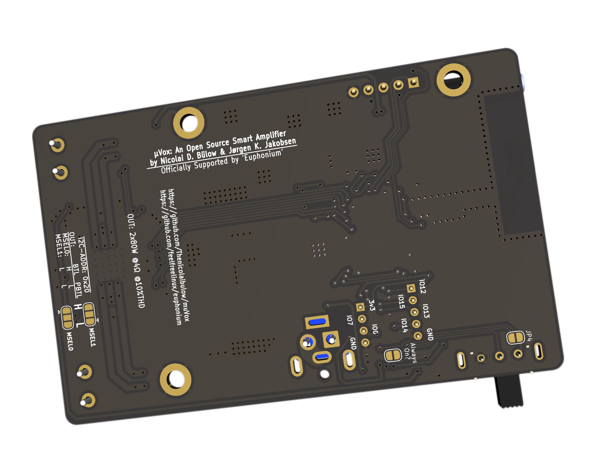

# µVox

Is an open source smart power audio amplifier, released under CC-BY-SA License.
Powered by the Merus MA12070P Amplifier 🔊 & an ESP32 Pico µC. 

This repository contains the KiCAD PCB project files for µVox. **Requires KiCAD 6.0**

## Goals

- To provide a truly plug and play amplifier solution to **any** speaker. 
- Allow **anybody** have a truly open audio streaming solution.
- Let this platform be flexible enough to live up any, and all, expectations for a fully digital smart amplfier. 
- Don't let anyone be stuck with a unusable device, even late in its product lifecycle.  

## Hardware Features

µVox is the first, of many designs, in our portfolio. We're eager to release our platform, and have thus oped to release our first, and certainly most minimal design, as an standing invitation for the comminunity to come join our open audio-endeavours.
µVox features the essential hardware necessary, for anyone to get started with open audio, this includes: 

- Audio Amplifier IC (Merus MA12070P)
  - 2 x 80W (@ 10% THD) or 2 x 35W (@ 1% THD), @ DC 26V input.
  - Supply Voltage 7-26V.
  - Multilevel Class-D Switching technology for unparalleled power efficiency.
    
- ESP32 Pico V3-02 Microprocessor Core
  - 8MB Flash + 2MB PSRAM
  - Wifi (2.4 GHz) & Bluetooth connectivity.
  - Single ceramic chip antenna design. 
  - Unlimited possibilities, with regards to functionality. Your fantasy is the limit!

- Onboard RGB Neo-Pixels for user feedback.

- JST Connector for option U/I board
  - Volume Up / Down buttons. 
  - Power / function button, with push-and-hold to power feature.

- Power Protection Circuit
  - Reverse polarity protection.
  - Short circuit protection.

- All the essential DC-DC power regulation.

- Connector for external USB/UART bridge, for programming the µC. 

## Software Features

Officially supported by 'Euphonium', the most sophisticated open source embedded audio streaming platform we've ever seen, µVox is able to not only do classic A2DP Bluetooth Audio Streaming, but also native Spotify Connect (yes, you read it right!), and also webradio. All of this functionality is bundled with a web-interface, hosted directly on the ESP, such that µVox is a stand-alone all-in-one open source streaming platform. 
See, FeelFreeLinux' repository for more details: https://github.com/feelfreelinux/euphonium
'Euphonium' is under rapid development, and as such isn't quite product-mature (as of mid March '22), but we're in daily contact with FeelFreeLinux, updating oneanother with the latest features and bug-fixes.

## How to get involved!

Join our matrix-room! We update the ESP32-Audio community there regularly, and are always open to input, and or questions, there. 
https://matrix.to/#/#esp32_audio:matrix.org

